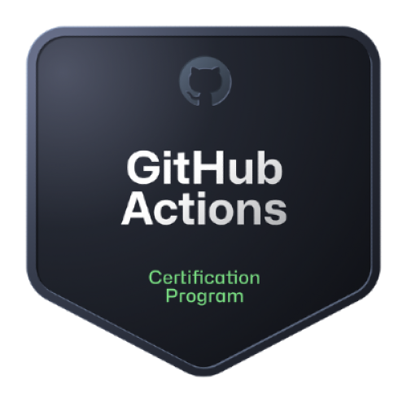
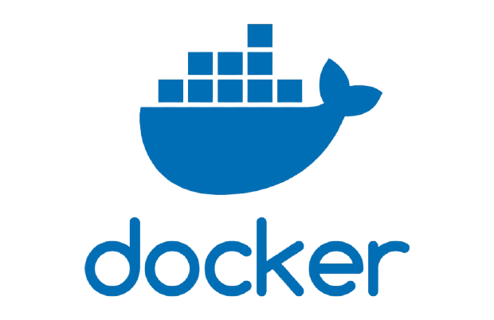
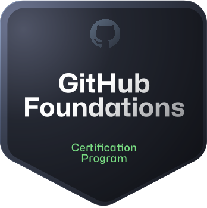
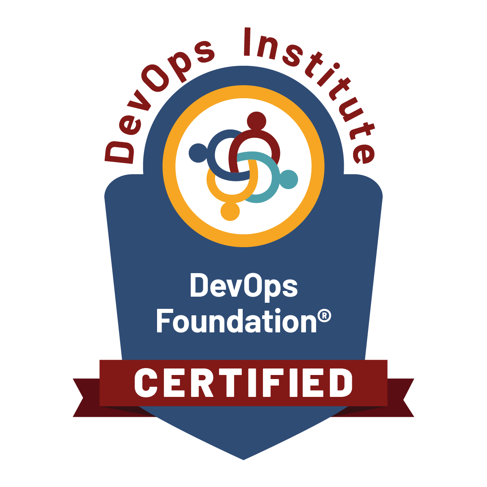

# Hi there 👋

I'm Abderrahmane ELAMRATI, a homelab enthusiast, DevOps tinkerer, and automation fan.

- 🛠️ Building out my homelab with Docker, Ansible, and Terraform
- 🌐 Sharing tools, stacks, and infrastructure tips
- 🧰 Checkout my [stackdeck](https://github.com/yourusername/stackdeck) repo for my full toolset

## 🔧 Tech Stack
- Docker, Docker Compose
- Ansible
- Terraform
- Prometheus + Grafana
- Home Assistant, AdGuard Home

## 🚀 Recent Projects
- Self-hosted media stack with Jellyfin + Sonarr + Radarr
- Local DNS and ad-blocking with AdGuard Home
- Infrastructure monitoring with Prometheus, Telegraf & Grafana

## 🧾 Certifications

<table>
  <tr>
    <td>
      
    </td>
    <td>
      <strong>GitHub Actions Certification</strong> 
      🧪 Planning
    </td>
  </tr>
  <tr>
    <td>
      
    </td>
    <td>
      <strong>Docker Certified Associate</strong> 
      🛠️ Upcoming
    </td>
  </tr>
  <tr>
    <td width="120px">
      
    </td>
    <td>
      <strong>GitHub Foundations Certification</strong> 
    </td>
  </tr>
  <tr>
    <td>
      
    </td>
    <td>
      <strong>Azure Administrator Associate (AZ-104)</strong> 
    </td>
  </tr>
  <tr>
    <td>
      
    </td>
    <td>
      <strong>Azure Fundamentals (AZ-900)</strong> 
    </td>
  </tr>
  <tr>
    <td>
      
    </td>
    <td>
      <strong>DevOps Foundation® Certification</strong> 
    </td>
  </tr>
</table>

---

_Always tinkering, always learning._

- 🔭 I’m currently working on securing my Homelab services and exposing some via Traefik
- 🌱 I’m currently learning Git,Azure and Docker
- 👯 I’m looking to collaborate on ...
- 🤔 I’m looking for help with ...
- 💬 Ask me about ...
- 📫 How to reach me: [LinkedIn](https://www.linkedin.com/in/abderrahmane-elamrati/)
- 😄 Pronouns: ...
- ⚡ Fun fact: ...

